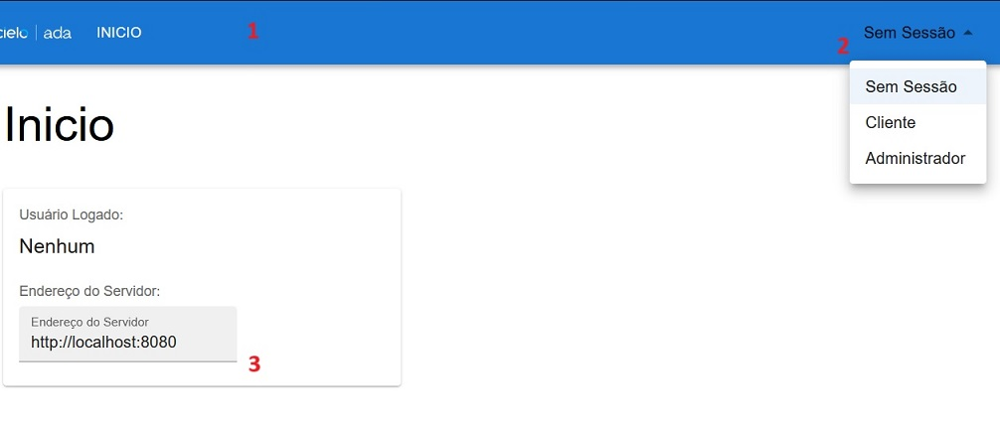

# Bootcamp Cielo Ouvidoria Frontend

Nessa aplicação é possível enviar e consultar mensagens AWS SQS através do nosso servidor JAVA.
A aplicação pode ser acessada em: 

## Arquitetura
- /components: Pasta onde estão componentes para serem utilizados nas páginas/
- /pages: Componentes que agem como páginas da aplicação, geralmente acessados atráves de uma rota.
- /services: Contexto central e serviços.
  - ServicesContext.tsx: Contexto central que carrega instancias unicas de todos os outros serviços:
    - ApiService: Responsável pelas chamadas ao servidor.
    - I18nService: Responsável pel tradução de tokens.
    - LoginService: Gerencia autenticação.

## Inicio
1. Navegação principal, as opções serão diferentes dependendo do usuário logado.
2. Selecione o usuário para logar
3. É possível alterar o endereço padrão do servidor.

## Enviar Mensagem
É possível enviar mensagem apenas quando logado como 'Cliente'

## Listar Filas e Tamanho
é possível acessar as filas e seus tamanhos ao logar com usuário 'Administrador'

## Scripts Disponíveis

No diretório do projeto, você pode executar:

### `npm start`

Executa a aplicação no modo de desenvolvimento.\
Abra [http://localhost:3000](http://localhost:3000) para visualizá-la no navegador.

A página será recarregada se você fizer edições.\
Você também verá quaisquer erros de lint no console.

### `npm test`

Inicia o executor de testes no modo interativo de observação.\
Consulte a seção sobre [execução de testes](https://facebook.github.io/create-react-app/docs/running-tests) para obter mais informações.

### `npm run build`

Compila a aplicação para produção na pasta `build`.\
Ele agrupa o React corretamente no modo de produção e otimiza a compilação para obter o melhor desempenho.

A compilação é minificada e os nomes dos arquivos incluem os hashes.\
Sua aplicação está pronta para ser implantada!

Consulte a seção sobre [implantação](https://facebook.github.io/create-react-app/docs/deployment) para obter mais informações.

# Utilização